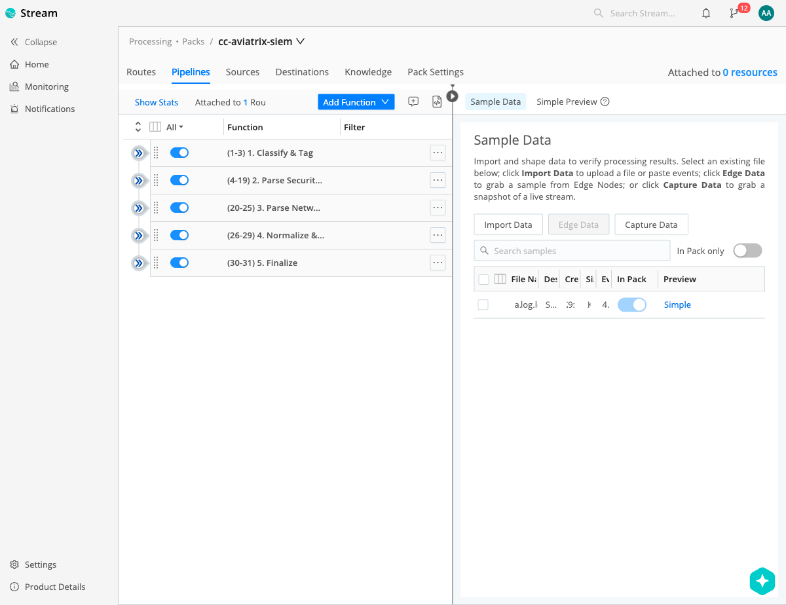
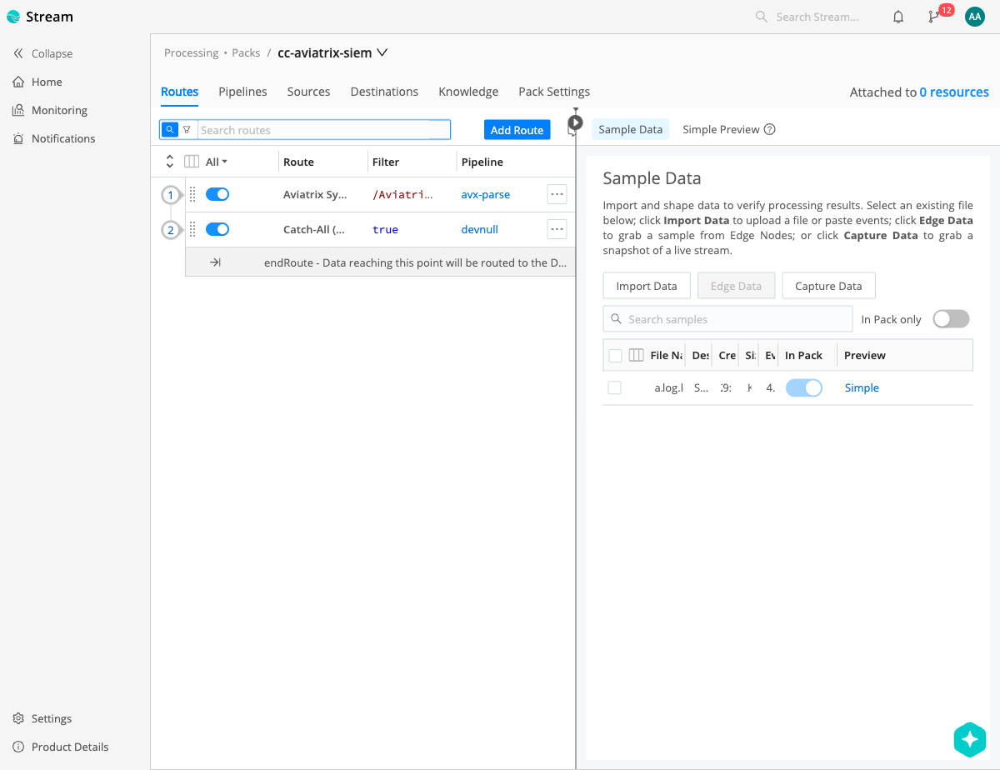
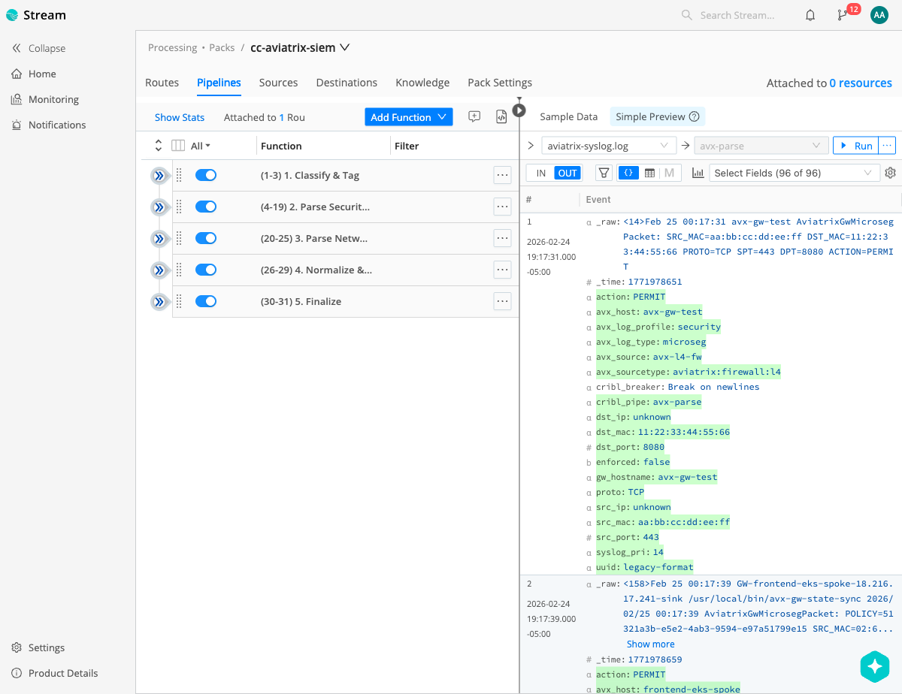

# Aviatrix Cloud Network Security — Cribl Stream Pack

Parse, normalize, and route Aviatrix Cloud Network syslog data through Cribl Stream for delivery to any SIEM or observability destination.

## Overview

This Pack replaces the standalone [Aviatrix SIEM Connector](https://github.com/AviatrixSystems/aviatrix-siem-connector) (Logstash-based) for customers who already run Cribl Stream. Instead of deploying and managing separate Logstash infrastructure, the Pack runs natively inside your existing Cribl workers.

### What It Does

1. **Classifies** incoming Aviatrix syslog by log type
2. **Parses** structured fields using Grok patterns and JSON extraction
3. **Normalizes** timestamps, converts field types, computes derived metrics
4. **Tags** each event with `avx_sourcetype`, `avx_source`, `avx_host`, and `avx_log_profile` for downstream routing

### Supported Log Types

| Log Type | Tag | Profile | Description |
|----------|-----|---------|-------------|
| L4 Microsegmentation | `microseg` | security | eBPF-enforced network policy (allow/deny) with session tracking |
| L7/TLS Inspection | `mitm` | security | Deep packet inspection via traffic_server TLS proxy |
| Suricata IDS/IPS | `suricata` | security | Intrusion detection/prevention alerts (JSON) |
| FQDN Firewall | `fqdn` | security | DNS-based firewall rule hits |
| Controller API Audit | `cmd` | security | API calls, admin actions (V1 and V2.5 formats) |
| Gateway Network Stats | `gw_net_stats` | networking | Interface throughput, packet rates, conntrack |
| Gateway System Stats | `gw_sys_stats` | networking | CPU, memory, disk utilization with per-core detail |
| Tunnel Status | `tunnel_status` | networking | Tunnel up/down state changes with cloud/region context |

### Log Profiles

Every event is tagged with `avx_log_profile` (`security` or `networking`) to support selective forwarding:

| Profile | Log Types | Use Case |
|---------|-----------|----------|
| `security` | microseg, mitm, suricata, fqdn, cmd | SIEM / SOC |
| `networking` | gw_net_stats, gw_sys_stats, tunnel_status | NOC / Observability |

Use these in Cribl Routes to fan out: security logs → Splunk/Sentinel, networking logs → Datadog/Dynatrace, or all → a single destination.

## Architecture

```
  Aviatrix Controller/CoPilot
           │
           │ Syslog (UDP/TCP 5000)
           ▼
  ┌────────────────────────┐
  │    Cribl Stream         │
  │                        │
  │  Route: Aviatrix Syslog │
  │         │               │
  │         ▼               │
  │  Pipeline: avx-parse    │
  │  ┌──────────────────┐  │
  │  │ 1. Classify      │  │
  │  │ 2. Parse Security│  │
  │  │ 3. Parse Network │  │
  │  │ 4. Normalize     │  │
  │  │ 5. Finalize      │  │
  │  └──────────────────┘  │
  │         │               │
  │    Route by profile     │
  │    ┌────┼────┐          │
  │    ▼    ▼    ▼          │
  └────────────────────────┘
       │    │    │
       ▼    ▼    ▼
   Splunk  S3  Sentinel  ...
```

## Quick Start

### 1. Install the Pack

- **From Git:** Processing → Packs → Add Pack → Import from Git → `https://github.com/AviatrixSystems/aviatrix-cribl-pack`
- **From .crbl file:** Processing → Packs → Add Pack → Import from File

### 2. Configure a Syslog Source

Create a Syslog Source in Cribl Stream:

| Setting | Value |
|---------|-------|
| Address | `0.0.0.0` |
| UDP Port | `5000` |
| TCP Port | `5000` |

### 3. Enable the Pack Route

The Pack includes a Route (`avx-syslog`) that matches Aviatrix log patterns. Ensure it's enabled and positioned before any catch-all routes.

### 4. Configure Aviatrix

In Aviatrix Controller → Settings → Logging → Remote Syslog:

| Setting | Value |
|---------|-------|
| Server | Cribl Stream worker IP/hostname |
| Port | `5000` |
| Protocol | UDP or TCP |

### 5. Set Up Destinations

Configure your SIEM destination(s) in Cribl Stream. Use the `avx_log_profile` field to route selectively:

**Route all logs to Splunk:**
```
Filter: avx_sourcetype != undefined
Pipeline: (passthru)
Destination: splunk-hec
```

**Route security → Splunk, networking → Datadog:**
```
Filter: avx_log_profile === 'security'    → splunk-hec
Filter: avx_log_profile === 'networking'  → datadog
```

## Output Fields Reference

### Common Fields (all events)

| Field | Type | Description |
|-------|------|-------------|
| `avx_sourcetype` | string | SIEM sourcetype (e.g., `aviatrix:firewall:l4`) |
| `avx_source` | string | Source identifier (e.g., `avx-l4-fw`) |
| `avx_host` | string | Gateway or controller hostname |
| `avx_log_type` | string | Normalized log type (e.g., `microseg`) |
| `avx_log_profile` | string | `security` or `networking` |
| `syslog_pri` | string | Syslog priority value |

### L4 Microsegmentation

| Field | Type | Description |
|-------|------|-------------|
| `uuid` | string | DCF policy UUID |
| `src_mac` / `dst_mac` | string | Source/destination MAC addresses |
| `src_ip` / `dst_ip` | string | Source/destination IPs |
| `src_port` / `dst_port` | integer | Source/destination ports |
| `proto` | string | Protocol (TCP, UDP, etc.) |
| `action` | string | PERMIT or DENY |
| `enforced` | boolean | Whether policy is enforced (vs. monitor mode) |
| `session_id` | string | Session tracking ID (8.2+) |
| `session_event` | string | 0=start, 1=end (8.2+) |
| `session_pkt_cnt` | string | Session packet count (8.2+) |
| `session_byte_cnt` | string | Session byte count (8.2+) |
| `session_dur` | string | Session duration in nanoseconds (8.2+) |

### L7/TLS Inspection

Includes microseg fields plus:

| Field | Type | Description |
|-------|------|-------------|
| `mitm_sni_hostname` | string | TLS SNI hostname |
| `mitm_reason` | string | POLICY, IPS_POLICY_DENY, IDS_POLICY_ALERT, etc. |
| `mitm_stage` | string | SNI, ORIGIN_CERT_VALIDATE, txn |
| `mitm_session_stage` | string | start, tls_check, end |
| `mitm_session_id` | string | L7 session UUID |
| `request_bytes` / `response_bytes` | integer | Byte counts (session end) |
| `suricata_sid` | string | Suricata signature ID (IPS/IDS events) |

### Suricata IDS/IPS

| Field | Type | Description |
|-------|------|-------------|
| `event_type` | string | Suricata event type |
| `signature` | string | Alert signature name |
| `signature_id` | integer | Signature ID |
| `severity` | integer | Alert severity (1-4) |
| `category` | string | Alert category |
| `alert_action` | string | allowed/blocked |
| `http_*` | various | HTTP fields (hostname, url, method, status) |
| `tls_*` | various | TLS fields (sni, subject, ja3) |
| `dns_*` | various | DNS fields (query, rrname, rrtype) |
| `flow_*` | various | Flow counters |

### Gateway Network Stats

| Field | Type | Description |
|-------|------|-------------|
| `gateway` / `alias` | string | Gateway name and alias |
| `public_ip` / `private_ip` | string | Gateway IPs |
| `interface` | string | Network interface (eth0, eth-fn0, etc.) |
| `total_rx_rate` / `total_tx_rate` | string | Raw rate strings (e.g., "54.07Kb") |
| `total_rx_rate_bytes` / `total_tx_rate_bytes` | number | Computed bytes/sec |
| `conntrack_count` | integer | Active connection tracking entries |
| `conntrack_allowance_available` | integer | Remaining conntrack capacity |
| `conntrack_usage_rate` | string | Conntrack utilization ratio |
| `bw_in_limit_exceeded` / `bw_out_limit_exceeded` | integer | Bandwidth limit violations |
| `pps_limit_exceeded` | integer | Packets-per-second limit violations |

### Gateway System Stats

| Field | Type | Description |
|-------|------|-------------|
| `gateway` / `alias` | string | Gateway name and alias |
| `cpu_idle` | float | CPU idle percentage |
| `cpu_busy` | number | Computed CPU busy percentage |
| `cpu_core_count` | integer | Number of individual CPU cores |
| `cpu_cores_parsed` | array | Per-core busy min/max/avg |
| `cpu_aggregate_busy_*` | integer | Aggregate CPU busy min/max/avg |
| `memory_free` / `memory_available` / `memory_total` | integer | Memory in KB |
| `disk_total` / `disk_free` | integer | Disk in KB |

### Tunnel Status

| Field | Type | Description |
|-------|------|-------------|
| `src_gw` / `dst_gw` | string | Full gateway string with cloud/region |
| `src_gw_name` / `dst_gw_name` | string | Gateway name only |
| `src_gw_cloud` / `dst_gw_cloud` | string | Cloud provider (AWS, Azure, etc.) |
| `src_gw_region` / `dst_gw_region` | string | Cloud region |
| `old_state` / `new_state` | string | Up or Down |

## Splunk Integration

When routing to Splunk HEC, map these fields in your Cribl Destination:

| Cribl Field | Splunk HEC Field |
|-------------|-----------------|
| `avx_sourcetype` | `sourcetype` |
| `avx_source` | `source` |
| `avx_host` | `host` |

### FQDN Firewall

| Field | Type | Description |
|-------|------|-------------|
| `gateway` | string | Gateway name |
| `src_ip` / `dst_ip` | string | Source/destination IPs |
| `fqdn_hostname` | string | Resolved FQDN (e.g., `*.amazonaws.com`) |
| `state` | string | MATCHED or DROPPED |
| `rule` | string | Matching firewall rule (e.g., `*.amazonaws.com;1`) |
| `drop_reason` | string | Reason for drop (when state=DROPPED) |

### Controller API Audit

| Field | Type | Description |
|-------|------|-------------|
| `controller_ip` | string | Controller IP address |
| `action` | string | API action (e.g., `USER_LOGIN_MANAGEMENT`) |
| `args` | string | Command arguments |
| `result` | string | Success or failure |
| `reason` | string | Failure reason (if applicable) |
| `username` | string | User who initiated the action |

## Screenshots

### Pipeline Stages
All 5 processing stages with 32 functions:



### Routes
Aviatrix Syslog route + Catch-All devnull:



### Preview — Microseg Event
Fully parsed L4 microsegmentation event with field extraction:



## Testing

The Pack includes 47 sample events in `aviatrix-syslog.log` covering all 8 log types. Use Cribl's Preview feature:

1. Open the `avx-parse` pipeline
2. In the Preview pane, select the `aviatrix-syslog.log` sample
3. Click **Run** to process all events
4. Verify all 8 log types parse with correct `avx_sourcetype` values

## Compatibility

| Component | Version |
|-----------|---------|
| Cribl Stream | 4.0+ |
| Aviatrix Controller | 7.x, 8.x |
| Log Formats | Legacy 7.x and 8.2+ session format |

## Migration from Logstash SIEM Connector

If you're migrating from the [aviatrix-siem-connector](https://github.com/AviatrixSystems/aviatrix-siem-connector):

1. Install this Pack in your Cribl Stream deployment
2. Point your Aviatrix syslog to the Cribl worker(s) on port 5000
3. Configure your SIEM destination in Cribl
4. Decommission the Logstash infrastructure (EC2 instances, NLB, etc.)

The Pack produces the same field names and sourcetypes as the Logstash connector for backward compatibility with existing SIEM dashboards and alerts.

## Contributing

See the [aviatrix-siem-connector CONTRIBUTING.md](https://github.com/AviatrixSystems/aviatrix-siem-connector/blob/main/CONTRIBUTING.md) for log format documentation and test methodology.

## Support

For issues with this Pack, contact:
- **Email:** support@aviatrix.com
- **GitHub Issues:** [aviatrix-cribl-pack](https://github.com/AviatrixSystems/aviatrix-cribl-pack/issues)

For Aviatrix product issues, visit the [Aviatrix Support Portal](https://support.aviatrix.com).

## Release Notes

### v0.1.0 (2026-02-28)
- Initial release
- 8 log types: L4 Microseg, L7/TLS, Suricata IDS, FQDN, CMD Audit, Gateway Net Stats, Gateway Sys Stats, Tunnel Status
- Single pipeline (`avx-parse`) with 5 processing stages
- Backward-compatible Splunk sourcetype mapping
- 47 sample events covering all log types
- Legacy 7.x and 8.2+ session format support

## License

MIT
