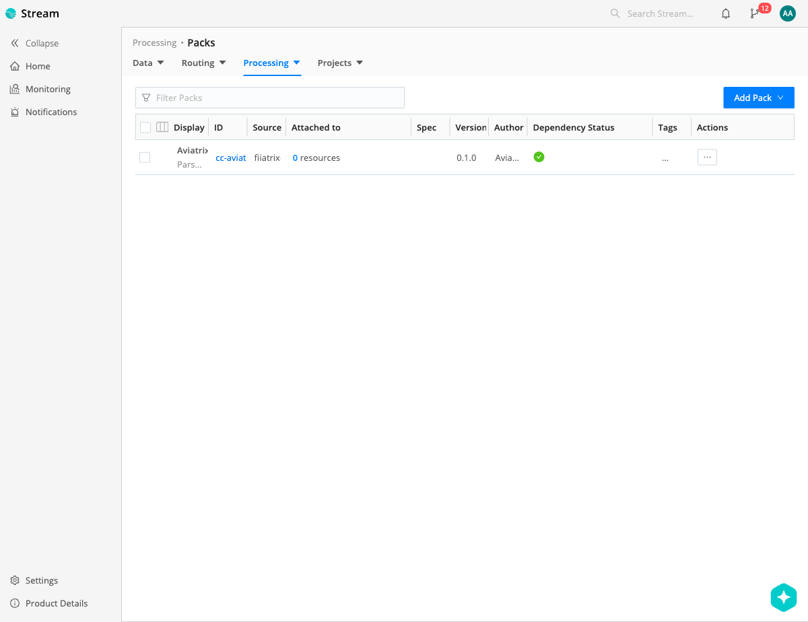
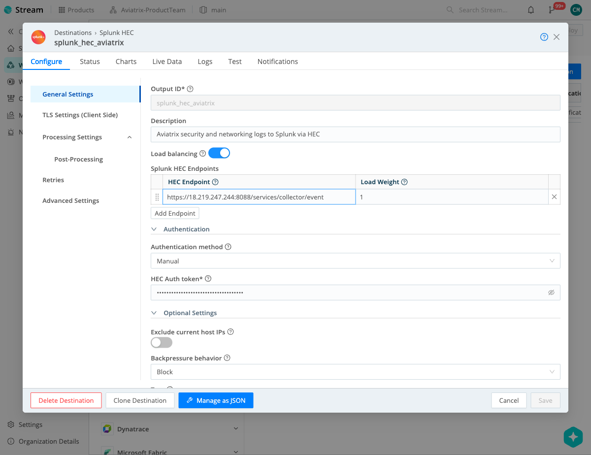
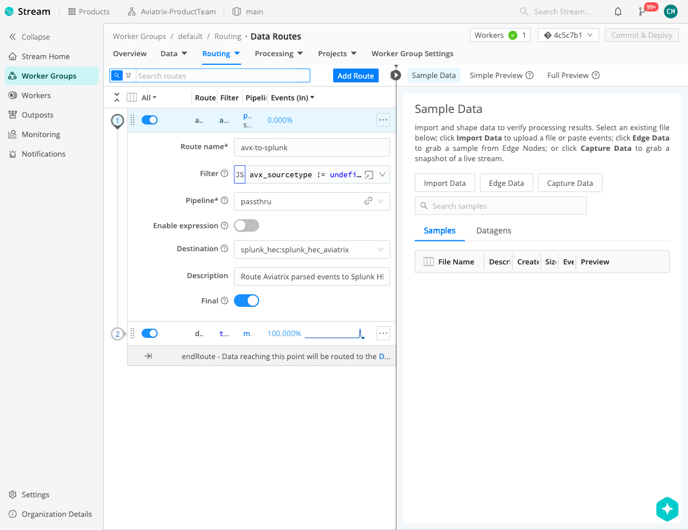
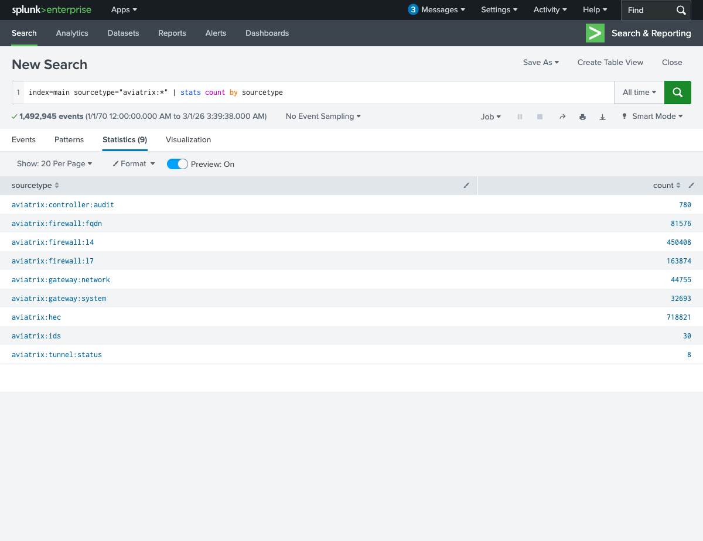
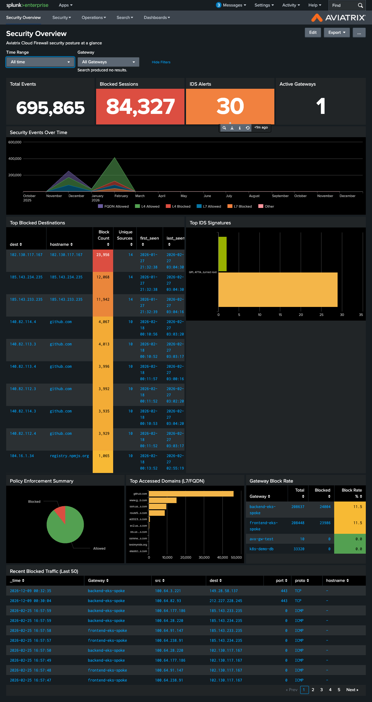

# Cribl Stream + Aviatrix Splunk App — Setup Guide

This guide walks through configuring Cribl Stream to receive Aviatrix syslog data, parse it with the Aviatrix Pack, and forward it to Splunk for use with the [Aviatrix Security Splunk App](https://splunkbase.splunk.com/app/5665).

## Prerequisites

- **Cribl Stream** 4.0+ (self-hosted or Cribl.Cloud)
- **Splunk Enterprise** with HTTP Event Collector (HEC) enabled
- **Aviatrix Security Splunk App** installed from Splunkbase
- **Aviatrix Controller/CoPilot** configured to send syslog

## Architecture

```
Aviatrix Controller/CoPilot
         │
         │ Syslog (UDP/TCP 5000)
         ▼
┌─────────────────────────┐
│     Cribl Stream        │
│                         │
│  Pack: cc-aviatrix-siem │
│  ┌───────────────────┐  │
│  │ Route: avx-syslog │  │
│  │   ▼               │  │
│  │ Pipeline: avx-parse│  │
│  │  1. Classify & Tag │  │
│  │  2. Parse Security │  │
│  │  3. Parse Network  │  │
│  │  4. Normalize      │  │
│  │  5. Finalize       │  │
│  └───────────────────┘  │
│           │              │
│  Route: avx-to-splunk   │
│           │              │
└──────────┬──────────────┘
           ▼
┌─────────────────────────┐
│   Splunk Enterprise     │
│   (HEC on port 8088)    │
│                         │
│   Aviatrix Security App │
└─────────────────────────┘
```

---

## Step 1: Install the Aviatrix Pack

1. In Cribl Stream, go to **Processing > Packs**
2. Click **Add Pack** and choose one of:
   - **Import from Git** — enter the repository URL
   - **Import from File** — upload the `.crbl` file
3. The pack appears as **cc-aviatrix-siem** version 0.1.0



### Verify the Pack

After import, click into the pack to confirm:

**Routes** — Two routes: `Aviatrix Syslog` (matches Aviatrix log patterns via regex) and `Catch-All` (sends unmatched events to devnull):


**Pipeline** — The `avx-parse` pipeline with 5 processing stages (31 functions total):


---

## Step 2: Configure a Syslog Source

Create a Syslog source to receive logs from Aviatrix:

1. Go to **Data > Sources > Syslog**
2. Click **Add Source** (or use an existing one)
3. Configure:

| Setting | Value |
|---------|-------|
| Address | `0.0.0.0` |
| UDP Port | `5000` |
| TCP Port | `5000` |

> **Note:** The port number must match what you configure in Aviatrix Controller. Port 5000 is the default used by the Aviatrix SIEM Connector. If using Cribl.Cloud, your ingress endpoint will be in the format `<worker-group>.<workspace>.<org-id>.cribl.cloud` on the assigned port.

---

## Step 3: Create a Splunk HEC Destination

1. Go to **Data > Destinations > Splunk HEC**
2. Click **Add Destination**
3. Configure the following settings:

| Setting | Value |
|---------|-------|
| Output ID | `splunk_hec_aviatrix` |
| Description | `Aviatrix security and networking logs to Splunk via HEC` |
| HEC Endpoint | `https://<splunk-host>:8088/services/collector/event` |
| Authentication method | Manual |
| HEC Auth token | Your Splunk HEC token |
| Backpressure behavior | Block |



### Splunk HEC Setup

If you haven't already configured HEC in Splunk:

1. In Splunk, go to **Settings > Data Inputs > HTTP Event Collector**
2. Click **Global Settings** and ensure HEC is **Enabled** with SSL
3. Click **New Token**, give it a name (e.g., `cribl-aviatrix`)
4. Set the **Default Index** to your target index (e.g., `main`)
5. Copy the generated token into the Cribl destination config above

> **TLS Note:** If your Splunk instance uses a self-signed certificate, you may need to disable certificate validation in the Cribl destination's **TLS Settings (Client Side)** section. For production, use a valid certificate.

---

## Step 4: Create a Data Route to Splunk

The Pack's internal routes handle parsing. You need a **worker group-level route** to forward the parsed events to Splunk.

1. Go to **Routing > Data Routes** (at the Worker Group level, not inside the pack)
2. Click **Add Route**
3. Configure:

| Setting | Value |
|---------|-------|
| Route name | `avx-to-splunk` |
| Filter | `avx_sourcetype != undefined` |
| Pipeline | `passthru` |
| Destination | `splunk_hec:splunk_hec_aviatrix` |
| Description | `Route Aviatrix parsed events to Splunk HEC` |
| Final | **Enabled** |



### How the Filter Works

The Pack's `avx-parse` pipeline sets `avx_sourcetype` on every successfully parsed event. The filter `avx_sourcetype != undefined` matches only events that were parsed by the Aviatrix Pack, so non-Aviatrix traffic passes through unaffected.

### Route Order

Ensure the `avx-to-splunk` route is positioned **before** any catch-all or default route. Routes are evaluated top-to-bottom — the first matching route wins.

---

## Step 5: Configure Aviatrix to Send Syslog

In Aviatrix Controller:

1. Go to **Settings > Logging > Remote Syslog**
2. Configure:

| Setting | Value |
|---------|-------|
| Server | Cribl Stream worker IP/hostname |
| Port | `5000` (or your configured port) |
| Protocol | UDP or TCP |

In Aviatrix CoPilot (if using CoPilot for log management):

1. Go to **Settings > Configuration > Logging**
2. Enable **Remote Syslog** and point to your Cribl worker

---

## Step 6: Deploy and Commit

1. After configuring the route and destination, click **Commit & Deploy** in Cribl Stream
2. Verify the deployment completes without errors
3. Check **Monitoring > Live Data** to confirm events are flowing

---

## Step 7: Verify in Splunk

### Check Events Are Arriving

Run the following search in Splunk:

```
index=main sourcetype="aviatrix:*" | stats count by sourcetype
```

You should see all 8 Aviatrix sourcetypes:

| Sourcetype | Log Type |
|------------|----------|
| `aviatrix:firewall:l4` | L4 Microsegmentation |
| `aviatrix:firewall:l7` | L7/TLS Inspection |
| `aviatrix:ids` | Suricata IDS/IPS |
| `aviatrix:firewall:fqdn` | FQDN Firewall |
| `aviatrix:controller:audit` | Controller API Audit |
| `aviatrix:gateway:network` | Gateway Network Stats |
| `aviatrix:gateway:system` | Gateway System Stats |
| `aviatrix:tunnel:status` | Tunnel Status |



### Verify the Aviatrix Security App

1. In Splunk, go to **Apps > Aviatrix Security**
2. Open the **Security Overview** dashboard
3. Set the **Time Range** appropriately (e.g., Last 24 hours or All time)
4. Verify the dashboard panels populate:
   - Total Events count
   - Blocked Sessions count
   - IDS Alerts count
   - Active Gateways count
   - Security Events Over Time chart
   - Top Blocked Destinations table
   - Top IDS Signatures chart
   - Policy Enforcement Summary
   - Top Accessed Domains
   - Gateway Block Rate
   - Recent Blocked Traffic



---

## Splunk Field Mapping

The Pack produces fields that are compatible with the Aviatrix Security Splunk App out of the box. The key metadata fields set by the Pack:

| Pack Field | Purpose | Example Value |
|------------|---------|---------------|
| `avx_sourcetype` | Maps to Splunk `sourcetype` | `aviatrix:firewall:l4` |
| `avx_source` | Maps to Splunk `source` | `avx-l4-fw` |
| `avx_host` | Maps to Splunk `host` | `backend-eks-spoke` |
| `avx_log_profile` | Log category for routing | `security` or `networking` |

### Optional: Explicit Field Mapping in Destination

If your Splunk HEC destination doesn't automatically pick up the sourcetype, you can map fields in the Cribl destination's **Processing Settings > Post-Processing**:

```javascript
// In a Cribl Eval function or destination post-processing:
sourcetype = avx_sourcetype
source = avx_source
host = avx_host
```

---

## Advanced: Split Security and Networking Logs

The Pack tags every event with `avx_log_profile` (`security` or `networking`). You can use this to route different log types to different destinations:

**Security logs to Splunk, Networking logs to Datadog:**

| Route | Filter | Destination |
|-------|--------|-------------|
| `avx-security-to-splunk` | `avx_log_profile === 'security'` | `splunk_hec:splunk_hec_aviatrix` |
| `avx-networking-to-datadog` | `avx_log_profile === 'networking'` | `datadog:datadog_aviatrix` |

**Security log types:** microseg, mitm, suricata, fqdn, cmd

**Networking log types:** gw_net_stats, gw_sys_stats, tunnel_status

---

## Troubleshooting

### No events in Splunk

1. Check **Monitoring > Sources** in Cribl to confirm syslog events are being received
2. Check **Monitoring > Routes** to see if events match the `avx-to-splunk` route
3. Check the Splunk HEC destination's **Status** tab for delivery errors
4. Verify the HEC token is valid and the index exists in Splunk
5. Check network connectivity between Cribl workers and Splunk on port 8088

### Events arrive but sourcetype is wrong

- Ensure the Pack's internal route (`avx-syslog`) is matching events. Check that the syslog data contains Aviatrix log patterns
- Preview the `avx-parse` pipeline with sample data to confirm parsing works

### Aviatrix Security App dashboards are empty

- Confirm the sourcetype values match what the app expects (the `aviatrix:*` pattern)
- Check the time range in the dashboard — set to "All time" first to rule out time issues
- Verify the Splunk index being searched matches where events are stored

### Only some log types appear

- Different log types have different volumes. Tunnel status and IDS events are relatively rare compared to microseg or FQDN logs
- Check with `index=main sourcetype="aviatrix:*" | stats count by sourcetype` to see all types present
